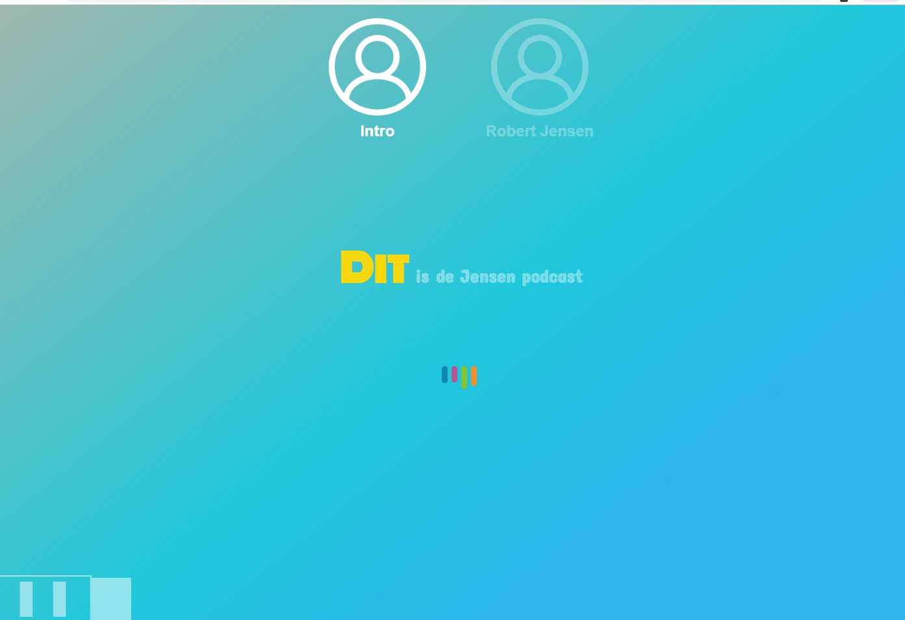

# Web design case: Marie van Driessen
Voor dit vak heb ik een een exclusief design website gemaakt marie van driessen. Marie van Driessen is doof en voor haar. Ik heb mij voornamelijk gefocussed op het ervaring van een podcast voor haar een stuk levendiger en plezieriger maken. 

## Caption Website
Link prototype: https://affectionate-minsky-ccb177.netlify.com/


De bedoeling van deze website is om een saaie caption van een podcast wat levendiger te maken. Dit word gedaan door aan de hand van de toonhoogtes en hoe mensen iets zeggen de caption zo te stylen dat de captions mee gaan met de spreker. Door het gebruik van verschillende fonts, kleuren en tekst maninupulatie's word dit effect bereikt. 

### Uitleg Product

#### Sprekers
Alle sprekers in de podcast (inclusief de intro) word bovin de website weergeven. Wanneer een spreker aan het praten is dan word het icoontje van de spreker uitgelicht.

#### Caption
Het hele zin word eerst weergeven. De captions licht op tegelijk met de spreker. Elke woord gaat mee met spreker aan de hand van hoe hard de spreker praat en hoe hij iets zegt.

#### Equalizer
Door de equalizer kan je zien of er een achtergrond nummer aan het draaien is. Wanneer de equalizer weg is dan is er ook geen achtergrond muziek meer.

#### Time indicator en play/pause button
Een indicator van hoe lang de podcast nog duurt en links heb je een play pause button.


Gebruikte Fonts:
*   Monoton
    *   Deze font geeft een soort van een showbusiness gevoel (word voornamelijk alleen gebruikt voor de intro)
*   Arial
    *   Font voor naam van de spreker
*   Concert One
    *   Default caption font
*   Pirate One
    *   Sigaar font
*   Great Vibes   
    *   Spaanse achtige feel font

```html
<link href="https://fonts.googleapis.com/css?family=Concert+One|Monoton|Pirata+One|Great+Vibes&display=swap" rel="stylesheet">
```

## Feedback en iteratie
### Test vragen
1.  Vind je het storend dat de tekst fonts veranderen?
2.  Vind je het storend dat de tekst kleur veranderen?
3.  Zit de equalizer in de weg?
4.  Leest het storend in het algemeen?
5.  Nog enige verbeterpunten?

### Feedback Eerste gesprek met Marie van Driessen
*   Laat Geluiden zien die normaal niet in een caption te zien valt(zoals achterground muziek etc.)
*   Captions met de snelheid van de spreker mee laten gaan.

### Feedback van klasgenoot: Karin
*   Equalizer moet stoppen wanneer achtergrond muziek ook stopt

### Feedback van klasgenoot: Tjebbe
*   Waveform toepasse op de hoogte en hardheid van hoe iemand praat
*   User interface interessanter maken
    *   Word wellicht teveel omdat er niet per se veel bij hoeft


### Iteratie
*   Equalizer gaat nu mee het achtergrond muziek