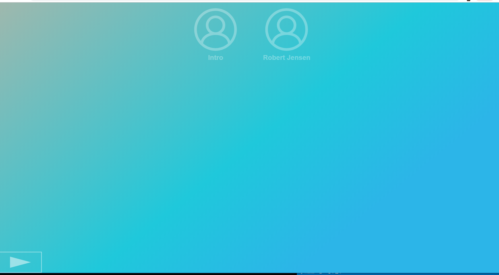

# Web design case: Marie van Driessen
Voor dit vak heb ik een een exclusief design website gemaakt marie van driessen. Marie van Driessen is doof en voor haar. Ik heb mij voornamelijk gefocussed op het ervaring van een podcast voor haar een stuk levendiger en plezieriger maken. 

## Caption Website
Link prototype: https://affectionate-minsky-ccb177.netlify.com/



De bedoeling van deze website is om een saaie caption van een podcast wat levendiger te maken. Dit word gedaan door aan de hand van de toonhoogtes en hoe mensen iets zeggen de caption zo te stylen dat de captions mee gaan met de spreker. Door het gebruik van verschillende fonts, kleuren en tekst maninupulatie's word dit effect bereikt. 

Gebruikte Fonts:
*   Monoton
    *   Deze font geeft een soort van een showbusiness gevoel (word voornamelijk alleen gebruikt voor de intro)
*   Arial
    *   Font voor naam van de spreker
*   Concert One
    *   Default caption font
*   Pirate One
    *   Sigaar font
*   Great Vibes   
    *   Spaanse achtige feel font

```html
<link href="https://fonts.googleapis.com/css?family=Concert+One|Monoton|Pirata+One|Great+Vibes&display=swap" rel="stylesheet">
```